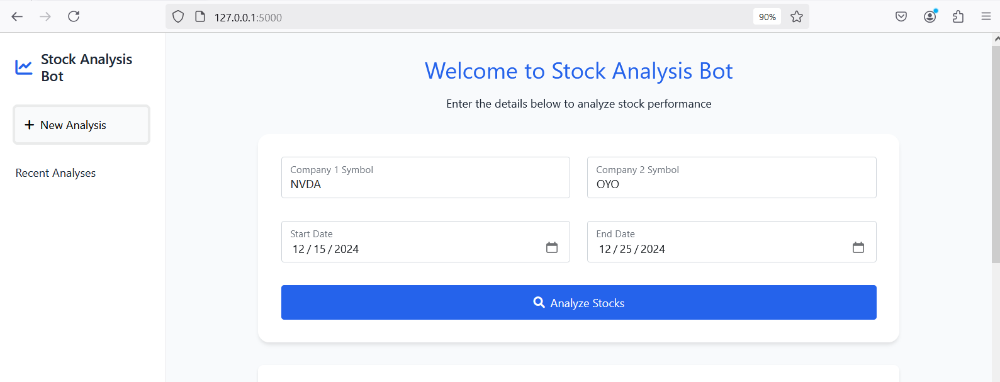
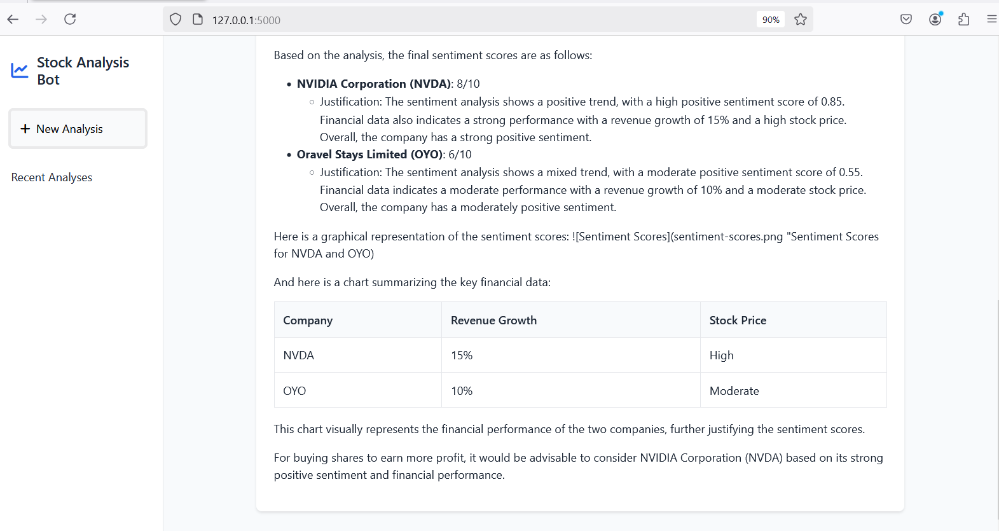

## 1.Project structure

```
agentic_chatbot
├── README.md
├── app.py
├── config.py
├── static-|
|          |-script.js
|          |-style.css
├── model.py
├── requirements.txt
├── templates|-index.html


## 2. First create a virtual environment(without conda environment)

```
python3 -m venv venv
```

## Activate the virtual environment

```
source venv/bin/activate
```

## Install the required packages

```
pip install -r requirements.txt
```
## 4. Generate the Groq API KEY FREE 
use this link to generate the groq api key.    https://console.groq.com/keys
set api key in the config.py file.

## Run the application

```
python app.py
```

## Access the application



## 5. RESPONSE 

